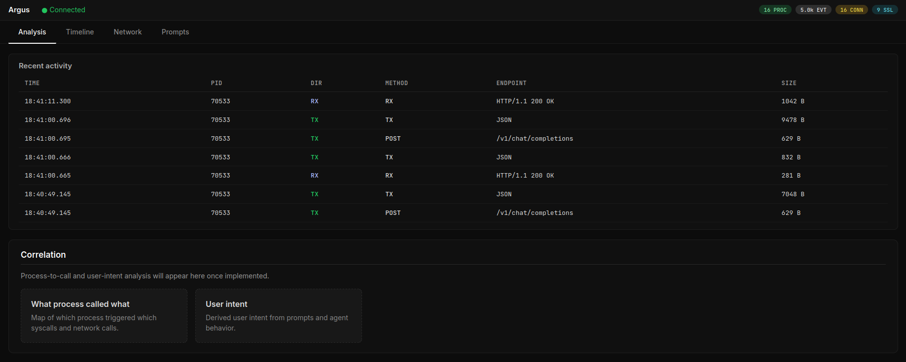
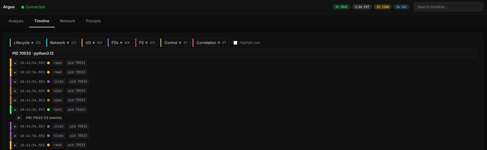
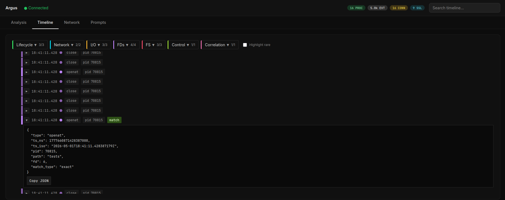
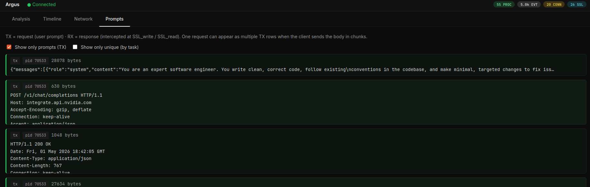

# Argus: Kernel-Layer Runtime Defense for LLM Agents Against Indirect Prompt Injection


Argus is a runtime defense for LLM agents against indirect prompt injection. It enforces the user's declared task intent at the kernel layer using eBPF — attaching to a running agent process with no source-code changes, framework modifications, or access to model internals. When a subprocess deviates from intent, Argus terminates only that child process — leaving the root agent process intact — and returns structured failure feedback so the agent can replan without discarding accumulated task context. This preserves task utility on legitimate work while containing the attack.

Evaluated on ORBIT across four frontier models (GPT-4o, GPT-4o-mini, Kimi K2 Instruct, Claude Sonnet 4.5), Argus achieves a mean **defense success rate of 84.6%** while completing 67–91% of benign tasks without interference.

---

## Why Kernel-Layer?

Existing defenses operate at the model, prompt, or application layer - above the execution boundary where harmful side effects occur. If malicious content successfully alters the agent's reasoning, the resulting file accesses, command executions, and network connections proceed unchecked. The system-call interface is the primary mediation point between user-space processes and kernel-managed resources: security-relevant actions are observable here regardless of the agent framework, model provider, or orchestration layer driving them. Because Argus's eBPF programs execute in kernel context outside the agent's address space, a compromised agent process cannot modify or disable the instrumentation.

| | Prompt-layer | Application-layer | **Argus (kernel-layer)** |
|---|:---:|:---:|:---:|
| Enforces at execution boundary | ✗ | ✗ | ✓ |
| No source-code or framework changes | ✓ | ✗ | ✓ |
| Works with any model (black-box API) | ✓ | ✗ | ✓ |
| Resistant to prompt-level evasion | ✗ | ✗ | ✓ |
| Agent replans without full session restart | ✗ | ✓ | ✓ |

---

## Requirements

**System:**
- Linux kernel ≥ 5.15 with BTF (`/sys/kernel/btf/vmlinux` must exist)
- Ubuntu 22.04+ (recommended)
- Root privileges + passwordless sudo for the daemon binary
- `clang`, `llvm`, `libbpf-dev`, kernel headers, Go 1.21+, Python 3.10+

```bash
sudo apt-get install -y clang llvm libbpf-dev linux-headers-$(uname -r) build-essential
```

Add the daemon to sudoers so it can be backgrounded without a password prompt:
```bash
echo "$USER ALL=(ALL) NOPASSWD: $(pwd)/daemon/daemon" | sudo tee /etc/sudoers.d/argus
```

**API keys:**

Agent model — set in `mini-swe-agent/.env`:
```bash
echo "OPENAI_API_KEY=your_key" > mini-swe-agent/.env
# or ANTHROPIC_API_KEY / NVIDIA_NIM_API_KEY depending on your model
```

L3 auditor — export before starting the daemon:
```bash
export ARGUS_AUDITOR_URL=https://integrate.api.nvidia.com/v1/chat/completions
export ARGUS_AUDITOR_API_KEY=your_key
export ARGUS_AUDITOR_MODEL=moonshotai/kimi-k2-instruct
```

**Python dependencies** (for benchmark):
```bash
pip install -r benchmark/requirements.txt
```

Node.js 20+ is needed only for the optional web UI.

---

## Quick Start

**Build:**

```bash
make build-bpf build-daemon
```

**Set up the agent** — Argus uses a modified [mini-swe-agent](https://github.com/swe-agent/mini-swe-agent) (included in the repo):

```bash
cd mini-swe-agent && python3 -m venv .venv && source .venv/bin/activate && pip install -e . && cd ..
```

**Run** — pid-file mode is recommended to avoid a PID attachment race:

```bash
# Set L3 auditor credentials (see Requirements for agent model key setup)
export ARGUS_AUDITOR_URL=https://integrate.api.nvidia.com/v1/chat/completions
export ARGUS_AUDITOR_API_KEY=your_key
export ARGUS_AUDITOR_MODEL=moonshotai/kimi-k2-instruct

# Cache sudo credentials so the daemon can be backgrounded without blocking
sudo -v

# Start Argus first
sudo -E ./daemon/daemon --pid-file /tmp/agent.pid --ws-addr 127.0.0.1:7071 --block &

# Launch the agent via the wrapper that writes its PID
./benchmark/scripts/run_task.sh --task "your task here" \
  --daemon-log /tmp/daemon.log --mini-log /tmp/mini.log
```

**Or attach to an already-running agent:**

```bash
pgrep -af "python.*mini|mini"                                                    # find PID

sudo ./daemon/daemon --root-pid <PID> --ws-addr 127.0.0.1:7071                   # monitor only
sudo -E ./daemon/daemon --root-pid <PID> --ws-addr 127.0.0.1:7071 --block       # enforce
```

`--root-pid` and `--pid-file` are mutually exclusive.

---

## Web UI

```bash
make build-ui && make run-ui
```

Open **http://localhost:3000**.









| Tab | Content |
|---|---|
| Analysis | Live event counts and activity feed |
| Timeline | Every kernel event (fork, exec, exit, connect, file open) with filters and search |
| Network | Outbound connections grouped by process |
| Prompts | Decrypted LLM request/response snippets captured via TLS uprobes |

`Authorization: Bearer …` headers and `sk-…` API keys are redacted everywhere.

---

## How It Works

Argus captures the user's task description from the agent's first outbound LLM API call — before any external content enters the context window — and uses it as the immutable session intent against which all subsequent kernel events are evaluated. Every file access, network connection, and subprocess exec in the agent tree is classified through a three-layer pipeline:

| Layer | Mechanism | Latency |
|---|---|---|
| L1 — Exact match | Raw file path or network destination checked as a substring of captured LLM context | Sub-ms, in-memory |
| L2 — Structural match | Canonical path normalization + DNS-cache hostname matching; catches symlink aliases and relative paths | Sub-ms, in-memory |
| L3 — Semantic auditor | Unresolved events submitted to a secondary LLM; receives session intent and bounded behavioral context but never the agent's rolling context, so injected content cannot influence the verdict | External LLM call |

L1 and L2 handle the large majority of events deterministically with negligible overhead. L3 is reserved for genuinely ambiguous cases.

A **data-provenance correlation engine** runs alongside the pipeline, linking events across process boundaries to detect multi-step attack patterns, such as a sensitive file read followed by an unmatched outbound connection — that no single event would flag in isolation.

In blocking mode, Argus kills the offending subprocess only. The root session survives with its full task context. A per-session block budget (default 10) bounds total enforcement actions before full session termination.

### Layer 3 auditor

Layer 3 substantially improves coverage on novel and semantically ambiguous attacks. It works with any endpoint implementing the `/chat/completions` API:

```bash
export ARGUS_AUDITOR_URL=https://integrate.api.nvidia.com/v1/chat/completions
export ARGUS_AUDITOR_API_KEY=your_key
export ARGUS_AUDITOR_MODEL=moonshotai/kimi-k2-instruct

sudo -E ./daemon/daemon --root-pid <PID> --block
```

---

## Daemon Flags

| Flag | Default | Description |
|---|---|---|
| `--root-pid` | — | PID of the agent process to monitor. Mutually exclusive with `--pid-file`. |
| `--pid-file` | — | Path the agent writes its PID to; Argus attaches on file creation. Mutually exclusive with `--root-pid`. |
| `--ws-addr` | `127.0.0.1:7070` | WebSocket address for the UI and benchmark pipeline (use `7071` — the UI and `run_task.sh` connect on that port) |
| `--block` | off | Enable enforcement — SIGKILL offending subprocesses on violation |
| `--block-budget` | `10` | Max blocking actions per session; on exhaustion the root agent PID is terminated |
| `--structured-block-response` | off | Write `/tmp/argus_last_block.json` before killing, giving the agent a structured explanation for replanning |
| `--session-intent` | — | Pre-seed session intent; overrides TLS-captured intent |
| `--auditor-url` | — | L3: any `/chat/completions`-compatible endpoint URL (overrides `ARGUS_AUDITOR_URL`) |
| `--auditor-api-key` | — | L3: API key (overrides `ARGUS_AUDITOR_API_KEY`) |
| `--auditor-model` | — | L3: model ID (overrides `ARGUS_AUDITOR_MODEL`) |
| `--max-events` | `50000` | Maximum events retained in memory |
| `--snippet-max-chars` | `8192` | Max characters captured per LLM prompt/response snippet |
| `--debug-dim3` | off | Verbose logging for L3 ingestion and intent matching |

---

## Build

```bash
make build-bpf       # compile eBPF programs
make build-daemon    # compile Go daemon
make build-ui        # install UI dependencies (once, before make run-ui)
make deps            # print dependency hints
```

After any change to `bpf/`, run `make build-bpf` before rebuilding the daemon.

---

## Benchmark

We introduce **ORBIT** (OS-level Runtime Benchmark for Injection Threats) — a benchmark purpose-built for evaluating OS-level agent defenses using live execution, real shell commands, and kernel-level syscall ground truth across seven attack suites. Unlike prior benchmarks that simulate tool calls as Python functions, ORBIT executes real payloads and measures defense at the system boundary.

Pre-computed metrics for all four models are in `benchmark/saved_results/`. See [`benchmark/README.md`](benchmark/README.md) for full details, reproduce commands, and run-from-scratch instructions.

---

## Repository Layout

| Path | Purpose |
|---|---|
| `bpf/` | eBPF programs — tracepoints and uprobes, ring-buffer event delivery |
| `daemon/` | Go daemon — BPF loader, process tree tracker, detection pipeline, WebSocket API |
| `ui/` | Next.js web UI — Analysis, Timeline, Network, Prompts |
| `benchmark/` | ORBIT benchmark — attack suites, pipeline, evaluation scripts, saved results |
| `mini-swe-agent/` | Modified mini-swe-agent — LLM agent used as the benchmark target (upstream: [swe-agent/mini-swe-agent](https://github.com/swe-agent/mini-swe-agent)) |
| `configs/` | Architecture notes and configuration reference |

---

## Troubleshooting

**Network and Prompts tabs empty** — you likely attached the shell wrapper rather than the Python interpreter. Use `pgrep -af python` to find the correct PID and reattach.

**Prompts never appear** — Argus attaches uprobes to `libssl.so`. If the agent uses a different TLS stack, no traffic is captured. Check the daemon log for SSL uprobe attach messages after startup.

**BPF fails to load:**
```bash
sudo sysctl -w kernel.perf_event_paranoid=-1
sudo apt-get install linux-headers-$(uname -r)
```

**BTF not found** — requires `/sys/kernel/btf/vmlinux`. Present by default on Ubuntu 22.04+ standard kernels. If missing: `sudo apt-get install linux-image-$(uname -r)-dbg`.
